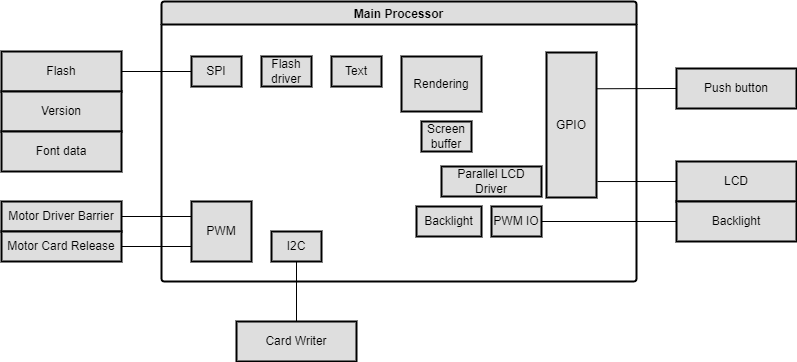
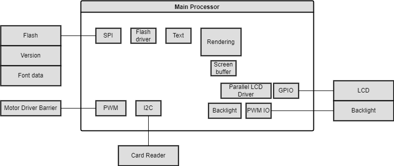

# Exercise 1: Idea project diagram

Tell us about an embedded system that does not exist. It can be grandiose or strange; it can be
something just one step beyond what you have around you. Ideally it is something you
personally want to build (even if physics doesn’t allow it). If you have a final project in mind, you
can start on that. If not, be imaginative, reality does not need to apply here.
What is it? What does it do? What general components do you need?
This should be summarized in 3-6 sentences. Then make at least one block diagram describing
the system as discussed in Chapter 2 and the associated lectures. More diagrams are better

# Smart Parking Lot

This is an initial idea of how to improve the lives of drivers inside a super crowded parking lot
looking for parking spaces. Much of the components in this design can still be improved or changed.

## Overview

The purpose of the system is to provide to the drivers with a parking space as soon as they registers
the entry into a supermarket or shopping mall, thus avoiding a fight to find a space on crowded days.

## How it works

1. When arriving at the parking lot, the driver presses a button on the terminal 1 (blue
box). The system identifies a parking space available and releases a card, informing in the display
in which space the driver should park the car.

2. When arriving at the reserved space, the driver passes the card through terminal 2 (orange box).
The system identifies if that space was reserved for him, if it was, the system opens the barrier and thus
releasing the space. Otherwise, the barrier is not opened.

## Hardware Block Diagram for terminal 1

## Software Block Diagram for terminal 1

## Hardware Block Diagram for terminal 2

## Software Block Diagram for terminal 2

