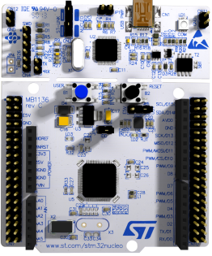
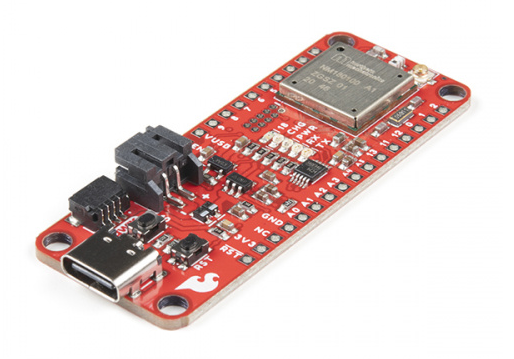
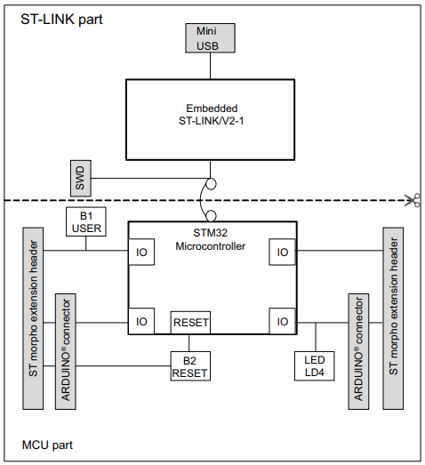
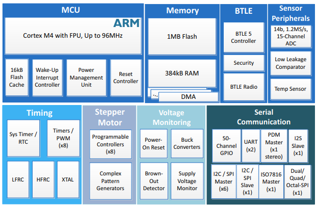

# Week 2: Exercise 1: Investigate Project Boards

1. Investigate the board intended for your final project.
2. Investigate the board assigned to you.

For each board, look at the datasheet and getting started information for the board. Draw the
hardware block diagram for the board. For peripherals, note the communication paths (SPI, I2C,
etc).

Look through the datasheet for the processor and other documents. Answer these questions:
- What kind of processor is it?
- How much Flash and RAM does it have? Any other memory types?
- Does it have any special peripherals? (List 3-5 that you find interesting.)
- If it has an ADC, what are the features?
- How much does the board cost vs what the processor costs? Is the processor in stock anywhere? (Try Digikey, Mouser, Octopart, Google, and so on.)

Look at one application note for this board.

## Board intended for the final project 'STM32F411RE' versus assigned 'WRL-17506'

|                    |STM32F411RE | WRL-17506 |
|--------------------|--------------------|------------------|
|Board Image |  |  |
|Datasheets | [Board](https://www.st.com/resource/en/user_manual/um1724-stm32-nucleo64-boards-mb1136-stmicroelectronics.pdf) [Processor](https://www.st.com/resource/en/datasheet/stm32f411ce.pdf)| [Board](https://cdn.sparkfun.com/assets/4/4/f/7/e/expLoRaBLE_Thing_Plus_schematic.pdf) [Processor](https://cdn.sparkfun.com/assets/6/3/9/3/1/Apollo3_Blue_MCU_Data_Sheet_v0_9_1.pdf)
|Processor | ARM Cortex-M4, 32-bits, 100 MHz MCU + FPU (floating-point unit)| Ambiq Apollo3 ARM® Cortex® M4, 32-bits, 96MHz MCU + FPU (floating-point unit) |
|Flash and RAM| 512K or 1MB flash, 128K RAM | 1MB on-chip with external flash support, 246K RAM |
|Special Peripherals| 81 I/O ports with interrupt capability, 13 communication interfaces, 11 timers | u.FL Antenna Connector - BLE & RF, 24 GPIO, Secure Key Storage, Secure Boot, Secure OTA, External Flash Inline Encryption/Decryption |
|ADC Features | One 12-bit, 16 channels | 14-bit, 1.2 Msps , 15 channels |
|App Note | [DMA controller](https://www.st.com/resource/en/application_note/dm00046011-using-the-stm32f2-stm32f4-and-stm32f7-series-dma-controller-stmicroelectronics.pdf) | [SparkFun expLoRaBLE Hookup Guide](https://learn.sparkfun.com/tutorials/sparkfun-explorable-hookup-guide?_ga=2.50127846.1522509811.1648818860-1358993695.1648818860)
|Board Cost | $13.83 | $49.95 |
|Processor Cost | $7.30 in 80 | $7.12 in 100|
|Processor Stock | Digikey | Digikey |

## Block Diagrams

### STM32F411RE

### WRL-17506

